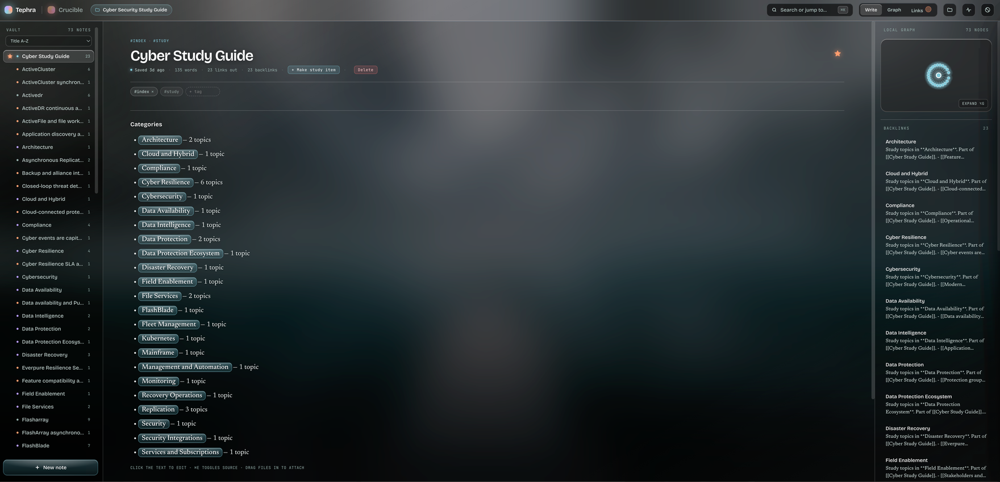
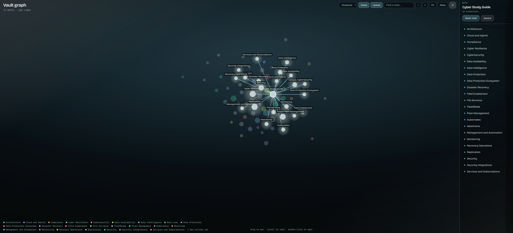
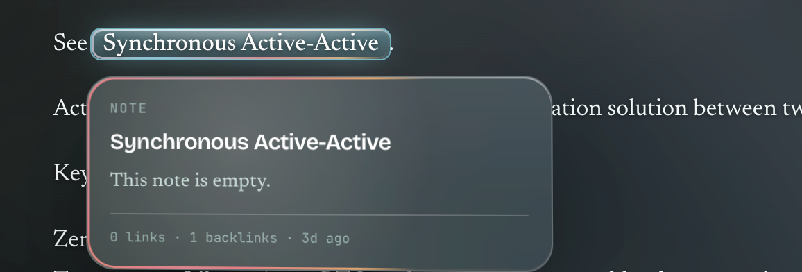
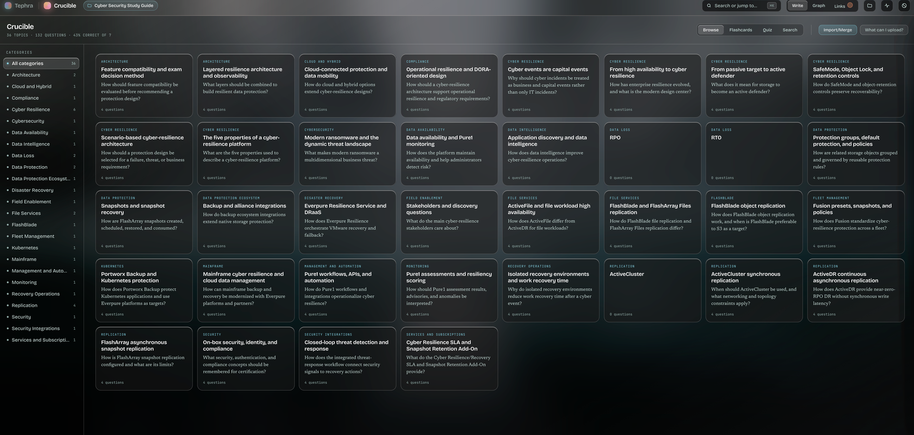
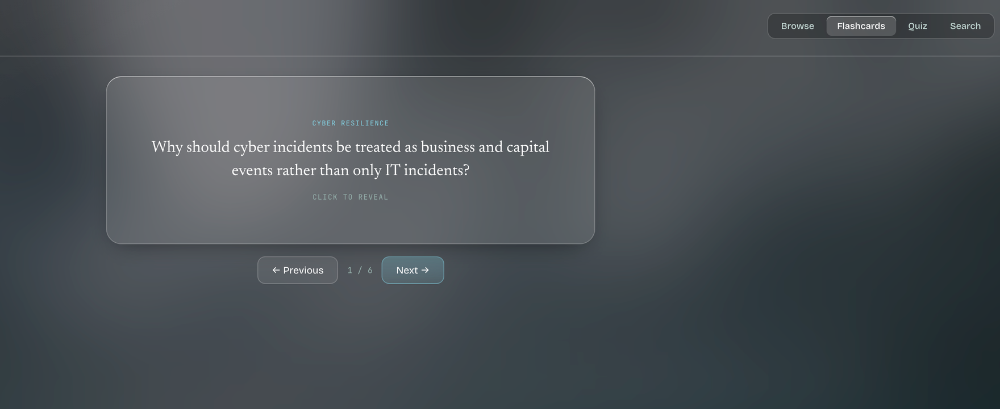
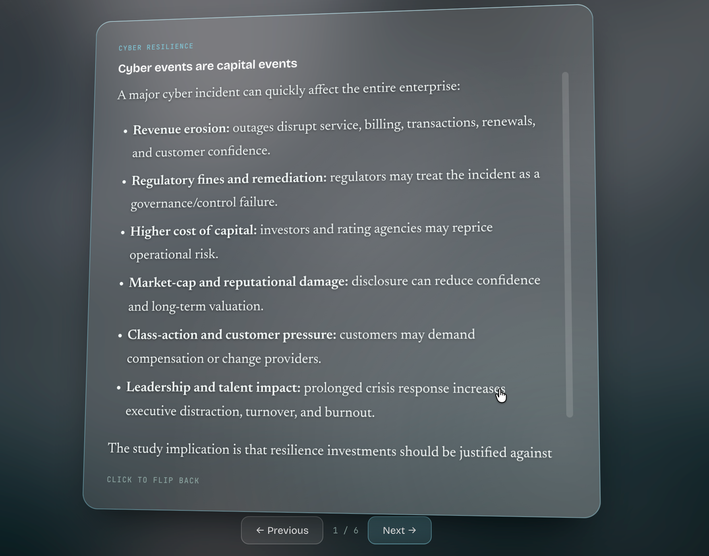
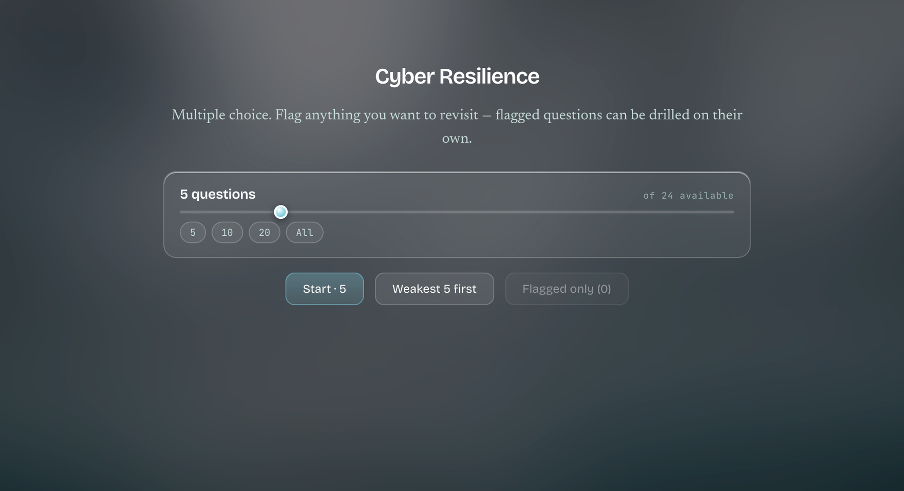
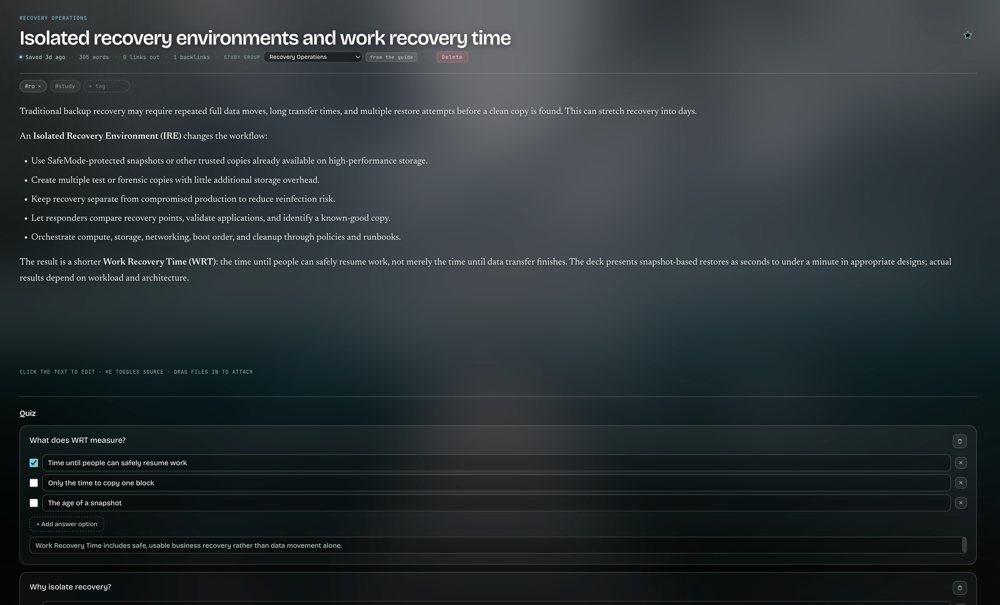

# Tephra

Tephra is a self-hosted notes app that turns a folder of plain markdown files
into a wiki. Write notes, link them with `[[Note Title]]`, and Tephra finds
the connections you didn't make yourself — unlinked mentions, recurring
terms that deserve their own page, a graph view of how everything connects.
It also ships **Crucible**, a study mode (flashcards, quizzes, weak-spot
tracking) that can be built straight from your notes or imported from a
structured guide.

Your data is never locked in. A vault is just a directory: `notes/*.md` with
a plain `key: value` header block (YAML-like, hand-parsed — not a full YAML
implementation), a `media/` folder, and a disposable SQLite index you can
delete at any time without losing anything.

## Strengths

- **Plain markdown is the source of truth.** No proprietary format, no
  database you can't read without the app. Edit files with any editor and
  hit reindex.
- **Auto-wiki linking.** Tephra surfaces unlinked mentions and recurring
  terms, and rewrites your actual markdown when you accept a suggestion —
  links live in the files, not a hidden database.
- **Self-hosted and private.** Runs on your own machine or server, loopback
  by default, no telemetry, no accounts required.
- **No framework, no build step.** The frontend is plain HTML/CSS/JS. Clone
  it and it runs.
- **One codebase, three shapes.** The same FastAPI server runs headless in a
  container, behind a native desktop window (macOS/Windows/Linux), or as a
  plain browser tab — never a second implementation to keep in sync.
- **Crucible study mode.** Turn any note into a flashcard/quiz item, or
  import a guide (JSON, Python, CSV, or Markdown) and merge it into your
  vault. Imports can carry their own images — point Tephra at a folder and
  it matches images to topics by filename automatically, even nested in
  subfolders.
- **Import is confirm-first.** Picking or dropping a guide never writes
  anything until you confirm. The default creates a brand-new vault, so
  there's nothing to accidentally merge into; merging into your current
  vault is an explicit, reviewed opt-in with a dry-run preview first.
- **A real graph view**, not a toy — force-directed or a zero-crossing radial
  tree, with stub/leaf filters to cut through a large vault.

## Screenshots

### Notes and the graph

A note, with backlinks and its local graph on the right:



The whole vault, clustered layout:



Hovering a `[[wikilink]]` previews the note it points to, without leaving the page:



### Crucible — study mode

Topics grouped by category:



A flashcard, front and flipped to its answer:

 

Quiz setup — pick a length, drill your weakest questions first, or flagged-only:



Any note can carry its own quiz block, editable right there in the note:



## What's next

- A filesystem watcher, so edits made outside the app appear without a
  manual reindex.
- Graph rendering performance beyond the current comfortable range
  (~1,500 nodes).
- Continued tuning of the auto-categorization model as it collects more
  corrections — it's a feedback loop, not a fixed model.
- Broader study-guide import ergonomics as real-world guides surface new
  edge cases.

## Running it

### With Docker (recommended)

```bash
git clone https://github.com/artech7/tephra.git
cd tephra
docker compose up -d --build
```

Open <http://localhost:8080>. First run seeds three example notes so the app
isn't empty.

To match file ownership to your host user (avoids root-owned files under
`./vault`):

```bash
UID=$(id -u) GID=$(id -g) docker compose up -d --build
```

Change the port with `TEPHRA_PORT=9000 docker compose up -d`.

#### `docker-compose.yml` example

The repo already includes one, but here's the minimal shape if you're
writing your own:

```yaml
services:
  tephra:
    build: .
    image: tephra:latest
    container_name: tephra
    restart: unless-stopped
    ports:
      - "8080:8000"
    volumes:
      - ./vault:/vault          # notes, media, and index live here
    environment:
      TEPHRA_DEFAULT_VAULT: /vault
    healthcheck:
      test: ["CMD", "python", "-c", "import urllib.request,sys; sys.exit(0 if urllib.request.urlopen('http://127.0.0.1:8000/api/health',timeout=3).status==200 else 1)"]
      interval: 30s
      timeout: 5s
      retries: 3
      start_period: 10s
```

### Without Docker

```bash
git clone https://github.com/artech7/tephra.git
cd tephra
python3 run.py
```

That's the whole thing. First run builds a private virtualenv in `.venv/`
and installs dependencies into it — your system Python is never touched.
Later runs skip straight to launching. Requires Python 3.10+.

```bash
python3 run.py --vault ~/Notes    # use a different vault
python3 run.py --headless         # server only, no window — for scripting/agents
python3 run.py --browser          # browser tab instead of a native window
python3 run.py --reinstall        # rebuild .venv from scratch
```

The vault defaults to `~/Documents/Tephra` and is remembered after the first
launch. **Linux** has no system webview by default — install
`python3-gi gir1.2-webkit2-4.1`, or use `--browser`.

### Desktop installers

Prebuilt macOS/Windows installers are produced by
`.github/workflows/build-installers.yml`, or build locally with
`./packaging/build_macos.sh` / `.\packaging\build_windows.ps1`. See
[CONTRIBUTING.md](CONTRIBUTING.md) for the full developer setup, test suite,
and codebase layout.

## Before you expose this

Tephra has **no authentication** — it's built for a trusted network or
loopback use. If you need it reachable from outside your LAN, put it behind
a reverse proxy that handles auth and TLS (Caddy with `basic_auth`,
Authelia, a Tailscale tailnet). Don't port-forward it directly.
